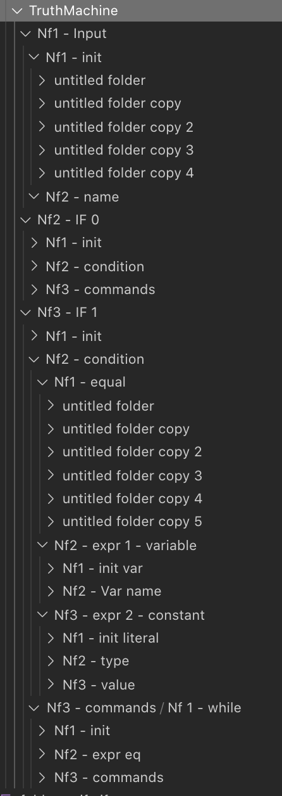

# Folders.py


Folders is an esoteric programming language, [created by Daniel Temkin](http://danieltemkin.com/Esolangs/Folders/) in 2015, which encodes the program _entirely_ into the **directory structure**.

All names of the folders as well as their contents are completely ignored. Instead, the commands
are encoded in the nesting of folders within folders.

Let me say that again: THE SOURCE CODE IS THE DIRECTORY STRUCTURE. Lol. 

This is a Python implementation of Folders for all operating systems to enjoy!

Folders is was originally implemented in [C#](https://github.com/rottytooth/Folders).

## Usage

### Install from pip
Simply install the `Folders` command line interpreter
```
pip install Folders
```

Give the folder of the program you wish to run as an command line argument

```
Folders sample_programs/HelloWorld
# => Hello, World!
```

If instead you would like list the Python code to stdout, use the `-l` option

```
Folders -l sample_programs/Fibonacci
# => print("Hello, World!", end='', flush=True)
```

### Run python
The implementation is just the python file, [folders.py](./folders.py) and has no dependencies, so if you'd like you can run `python folders.py` instead of pip installing and use it the same as in the examples above.


## Language details

The language details are on the [esolangs wiki](https://esolangs.org/wiki/Folders), but I've put it here for reference.

For example, take a look at the [Fibonacci sample program](./sample_programs/Fibonacci).

The root folder contains a list of _command folders_ - in this case labelled `Nf1..`, `Nf2..`, but the names don't actually matter except the alphabetical ordering - the first folder (which I've labelled with an `init`) is the first "sub-folder", the next is the second, etc.

### Commands:

Commands take the following form
| Command | # of folders | Details |
| ------- | ------------ | ----------------------------------------------------------------------------------------------------------- |
| if | 0 folders | Second sub-folder holds expression, third holds list of commands |
| while | 1 folder | Second sub-folder holds expression, third holds list of commands |
| declare | 2 folders | Second sub-folder holds type, third holds var name (in number of folders, ex. zero folders becomes "var_0") |
| let | 3 folders | Second sub-folder hold variable name (in number of folders), third holds an expression |

### Expressions:

Expression folders take the following form:
| Type | # of folders | Details |
|---------------|-----------|-----------------------------------------------------------------------------------------------------------|
| Variable | 0 folders | Second sub-folder holds variable name |
| Add | 1 folder | Second sub-folder holds the first expression to add, third holds second expression |
| Subtract | 2 folders | Second sub-folder holds the first expression to subtract, third holds second expression |
| Multiply | 3 folders | Second sub-folder holds the first expression to multiply, third holds second expression |
| Divide | 4 folders | Second sub-folder holds the first expression to divide, third holds second expression |
| Literal Value | 5 folders | Second sub-folder holds the type of the value (as described by types below, ex. two folders for a string) |
| Equal To | 6 folders | Second and third folders hold expressions to compare |
| Greater Than | 7 folders | Second and third folders hold expressions to compare (takes the form : second folder > third folder) |

### Types

And finally type folders take the following form:

| Type   | # of folders |
| ------ | ------------ |
| int    | 0 folders    |
| float  | 1 folder     |
| string | 2 folders    |
| char   | 3 folders    |

### Note on this implemementation

The `int`, `float`, and `char` types are 8-bit only. But, you can add into their variables to arbitrary length, so to get a very large number you can simply multiply it a bunch of times.

This is what the fibonacci program does.

## The absolute power of folders

Behold, the mighty Truth Machine program:



## A mighty meme-worthy point

_All Folders programs are 0 bytes_ if you're on windows, and windows interprets an empty folder as 0 bytes.

The ultimate code golf!

## Links

- [Folders on esolang](https://esolangs.org/wiki/Folders)
- [Folders homepage](http://danieltemkin.com/Esolangs/Folders/)
